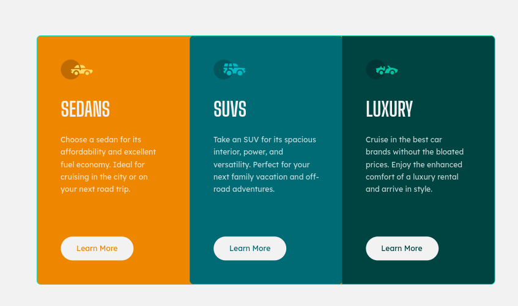
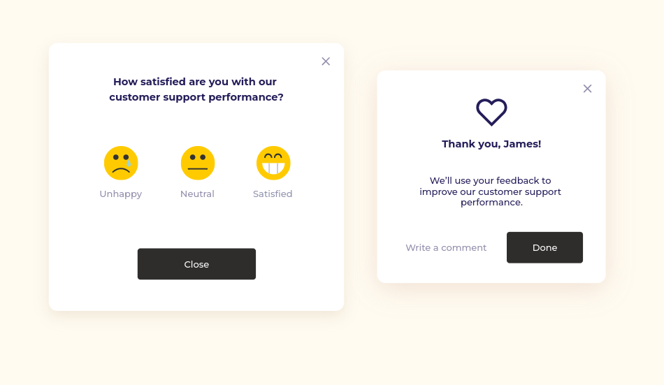
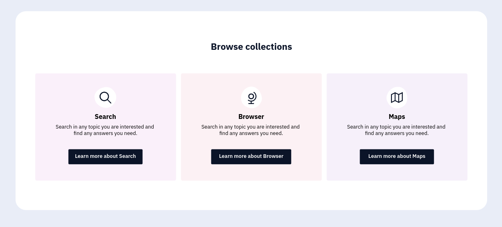
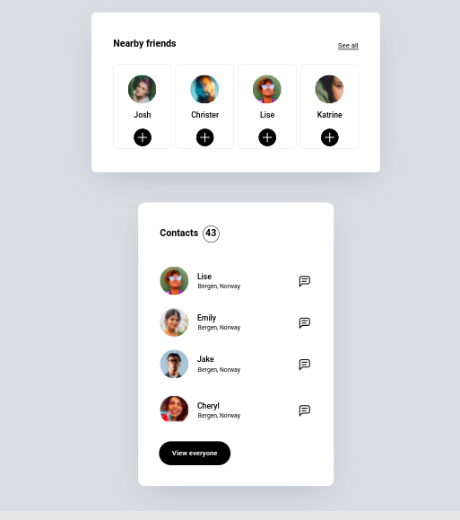
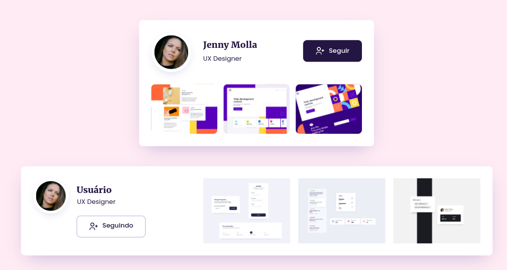

# Flex box

## Objetivo

Construir os layouts presentes no arquivo _layouts.penpot_ usando o flex box

## Contexto

Segundo o MDN, o Flexible Box Module, geralmente chamado de flexbox, foi projetado tanto como um modelo de layout unidimensional quanto como um método capaz de organizar espacialmente os elementos em uma interface, além de possuir capacidades avançadas de alinhamento.

Quando se descreve o flexbox como sendo unidimensional, enfatiza-se o fato de que ele lida com o layout em uma dimensão de cada vez - seja uma linha ou uma coluna.

## Layouts propostos

Ao todos, existem 5 layouts propostos. São eles:

### 3 Cards

### Feedback

### Lista de coleções

### Lista de pessoas

### Cards de usuários

